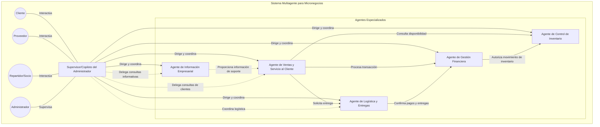

# Developer Guidelines for LiwAIsi - AI Micro-Businesses Assistant

This document provides comprehensive guidelines for developers working on the LiwAIsi project, outlining the architectural approach, development standards, and best practices to ensure a scalable, maintainable, and robust application.

## Table of Contents

1. [Architecture Overview](#architecture-overview)
2. [Domain-Driven Design Principles](#domain-driven-design-principles)
3. [Project Structure](#project-structure)
4. [Development Workflow](#development-workflow)
5. [Code Standards](#code-standards)
6. [Testing Strategy](#testing-strategy)
7. [Environment Configuration](#environment-configuration)
8. [Database Management](#database-management)
9. [Conversation State Management](#conversation-state-management)
10. [Integration with External Services](#integration-with-external-services)
11. [Security Guidelines](#security-guidelines)
12. [Documentation Standards](#documentation-standards)

## Architecture Overview

LiwAIsi follows a Clean Architecture approach with Domain-Driven Design (DDD) principles. The architecture is organized into distinct layers with clear responsibilities:

```mermaid
graph TD
    subgraph "Clean Architecture with DDD"
        UI[Interface Layer] --> |Uses| APP
        APP[Application Layer] --> |Uses| DOM
        APP --> |Uses| INFRA
        INFRA[Infrastructure Layer] --> |Implements| DOM
        DOM[Domain Layer] --> |Pure Domain Logic|
    end
```

### Key Architectural Principles

1. **Separation of Concerns**: Each layer has a specific responsibility
2. **Dependency Rule**: Dependencies only point inward (toward the domain)
3. **Abstraction**: Interfaces define boundaries between layers
4. **Testability**: Architecture facilitates comprehensive testing
5. **Scalability**: Components can scale independently

## Domain-Driven Design Principles

### Ubiquitous Language

- Develop and maintain a consistent language shared by developers and domain experts
- Document domain terminology in a glossary
- Use this language consistently in code, documentation, and discussions

### Bounded Contexts

- Identify distinct business domains within the application
- Define clear boundaries between contexts
- Establish context maps to document relationships between bounded contexts

### Entities and Value Objects

- **Entities**: Objects with identity (e.g., User, Product)
- **Value Objects**: Immutable objects defined by their attributes (e.g., Address, Money)
- **Aggregates**: Clusters of domain objects treated as a unit (e.g., Order with OrderItems)
- **Domain Events**: Represent significant occurrences within the domain

### Repository Pattern

- Provide collection-like interfaces for accessing domain objects
- Abstract persistence details from the domain layer
- Implement in the infrastructure layer

## Project Structure

```
src/
├── supervisor_assistant/
│   ├── domain/                 # Domain layer - business logic
│   │   ├── models/             # Domain entities and value objects
│   │   ├── repositories/       # Repository interfaces
│   │   ├── services/           # Domain services
│   │   └── events/             # Domain events
│   │
│   ├── application/            # Application layer - use cases
│   │   ├── services/           # Application services implementing use cases
│   │   ├── dtos/               # Data Transfer Objects
│   │   └── interfaces/         # Interfaces required by application layer
│   │
│   ├── infrastructure/         # Infrastructure layer - technical details
│   │   ├── persistence/        # Database implementations
│   │   │   ├── queries/        # SQL queries and database operations
│   │   │   └── migration.py    # Database migration logic
│   │   ├── web/                # Web server configuration
│   │   │   ├── app.py          # FastAPI application setup
│   │   │   └── server.py       # Server configuration
│   │   ├── ai/                 # AI components
│   │   │   ├── prompts/        # Prompt templates
│   │   │   └── models/         # AI model interfaces
│   │   ├── langgraph/          # LangGraph integration
│   │   │   └── checkpointer.py # PostgreSQL checkpointer
│   │   └── services/           # Infrastructure services
│   │       └── conversation_manager.py # Conversation state management
│   │
│   └── interface/              # Interface layer - user interfaces
│       ├── api/                # API endpoints
│       │   └── v1/             # API version 1
│       │       ├── models/     # API request/response models
│       │       └── routes/     # API route definitions
│       └── cli/                # Command-line interfaces
│
├── scripts/                    # Utility scripts
│   ├── setup_db.py             # Database setup script
│   └── generate_tools_config.sh # Tool configuration generator
│
├── config/                     # Configuration files
│   ├── settings.py             # Application settings
│   └── tools.template.yaml     # Template for tools configuration
│
└── tests/                      # Test suite
    ├── unit/                   # Unit tests (follows src structure)
    ├── integration/            # Integration tests
    └── e2e/                    # End-to-end tests
```

## Development Workflow

### Setting Up Development Environment

1. Clone the repository
2. Install dependencies: `pip install -r requirements.txt`
3. Install development dependencies: `pip install -r requirements-dev.txt`
4. Set up environment variables (see [Environment Configuration](#environment-configuration))
5. Set up the database: `python scripts/setup_db.py`
6. Run migrations: The application will handle this during startup

### Development Process

1. **Feature Planning**:
   - Understand the domain problem
   - Define the bounded context
   - Identify entities, value objects, and aggregates

2. **Implementation Flow**:
   - Start with domain models and interfaces
   - Implement application services
   - Add infrastructure implementations
   - Create interface components

3. **Version Control Guidelines**:
   - Use feature branches for development
   - Follow conventional commit messages
   - Require code reviews before merging

## Code Standards

### Python Style Guide

- Follow PEP 8 style guide
- Use type hints for all function parameters and return values
- Document all public functions, classes, and modules

### Naming Conventions

- **Classes**: PascalCase (e.g., `ProductService`)
- **Functions/Methods**: snake_case (e.g., `get_product_by_id`)
- **Variables**: snake_case (e.g., `user_id`)
- **Constants**: UPPER_SNAKE_CASE (e.g., `MAX_RETRY_COUNT`)
- **Private members**: Prefix with underscore (e.g., `_private_method`)

### Code Organization

- One class per file (with exceptions for closely related classes)
- Group related functionality in modules
- Keep files focused on a single responsibility

## Testing Strategy

### Test Types

- **Unit Tests**: Test individual components in isolation
- **Integration Tests**: Test interactions between components
- **End-to-End Tests**: Test complete workflows

### Test Organization

- Mirror the source code structure in the test directory
- Name test files with `test_` prefix
- Group tests by functionality

### Test Tools

- **pytest**: Primary testing framework
- **TestClient** (FastAPI): For API testing
- **httpx**: For HTTP client functionality

## Environment Configuration

### Environment Variables

Application configuration is managed through environment variables:

- `SERVER_HOST`: Host address (default: "0.0.0.0")
- `SERVER_PORT`: Port number (default: 8000)
- `SERVER_RELOAD`: Enable/disable auto-reload (default: True)
- `DATABASE_URL`: PostgreSQL connection string
- `TOOLBOX_BASE_URL`: URL for the Toolbox service

### Configuration Management

- Use `config/settings.py` for centralized settings management
- Use dataclasses for type safety
- Provide sensible defaults for development

## Database Management

### Migration Strategy

- Database creation is handled by `scripts/setup_db.py`
- Schema migrations are managed in `infrastructure/persistence/migration.py`
- Table definitions are in `infrastructure/persistence/queries/*.py`

### Database Access

- Use repository interfaces defined in the domain layer
- Implement repositories in the infrastructure layer
- Use dependency injection to provide repository implementations

## Conversation State Management

### State Persistence

- Use the PostgreSQL-based checkpointer for LangGraph to persist conversation states
- Implement fallback mechanisms for when the database is unavailable
- Ensure proper async/await patterns for database operations

### Conversation Management

- Use the singleton ConversationManager to maintain conversation context
- Store ConversationWorkflow instances by user ID (WhatsApp number)
- Ensure each user has a persistent workflow instance across API requests

## Integration with External Services

### Toolbox Service

- Connect to the Toolbox service for specialized tools
- Implement robust error handling and fallback mechanisms
- Use environment variables for service configuration

### External API Integration

- Abstract external services behind interfaces
- Implement proper error handling and retry logic
- Use dependency injection to provide service implementations

## Security Guidelines

### Credential Management

- Never hardcode credentials in source code
- Use environment variables for sensitive information
- For services that don't support environment variables, use generation scripts

Example for Toolbox service:
```bash
# Generate configuration with credentials from environment variables
./scripts/generate_tools_config.sh
```

### API Security

- Validate all input data
- Implement proper authentication and authorization
- Use HTTPS for all external communications
- Follow the principle of least privilege

## Documentation Standards

### Code Documentation

- Document all public APIs with docstrings
- Include parameter types and return values
- Explain complex algorithms and business rules

### Project Documentation

- Maintain up-to-date README.md with project overview
- Document architecture decisions in ADRs (Architecture Decision Records)
- Keep this DEVELOP.md updated with current development practices

---

## Agent Architecture

The LiwAIsi system implements a multi-agent architecture as shown in the README.md:



### Implementation Guidelines

- Implement each agent as a separate module in the domain layer
- Use LangGraph for agent workflows and coordination
- Maintain conversation context using the PostgreSQL checkpointer
- Implement proper error handling and fallback mechanisms
- Follow the prompt template system for consistent agent behavior

---

This document is a living guide and should be updated as the project evolves. All developers are encouraged to contribute to its improvement.
