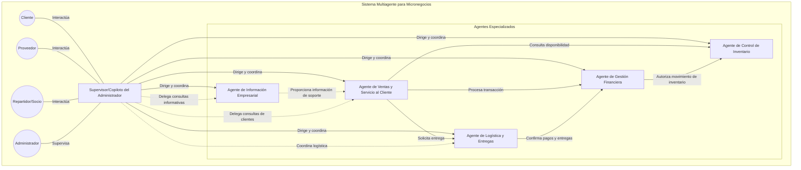

# LiwAIsi - Asistente Virtual para Micronegocios

## 🚀 ¿En qué consiste este asistente?
Imagina que inicias tu negocio con 5 empleados al tiempo. Cada uno de ellos tiene un rol diferente: 
- 1 encargado de ventas y servicio al cliente
- 1 encargado de logística y entregas
- 1 encargado de control de inventario
- 1 encargado de gestión financiera
- 1 encargado de información empresarial

Nuestro Asistente Virtual para Micronegocios es un sistema multiagente inteligente diseñado para ayudar a propietarios de pequeños negocios a gestionar y optimizar sus operaciones. Construido sobre una arquitectura de supervisor-agente, este sistema proporciona una solución integral para la gestión de micronegocios y emprendimientos a través de agentes de Inteligencia Artificial especializados que manejan diferentes aspectos de tu negocio.

## 🌟 Overview

## ¿Te interesa este asistente?

Puedes escribirnos un mensaje en nuestras redes:

[Liwaisi Tech Team](https://liwaisi.tech/about)
